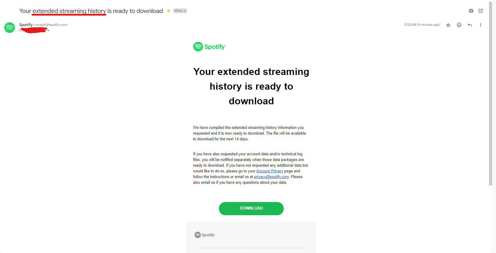

## how to tell the downloads apart (if needed)

## my spotify data
here is a image of the email you will get when they send the "my spotify data"

and here is the folder directory
  - My Spotify Data
    - Spotify Account Data
      - CustomerServiceHistoryAndSurveyData.json <-- not needed
      - Follow.json <-- not needed
      - Identifiers.json <-- not needed
      - Identity.json <-- not needed
      - Inferences.json <-- not needed
      - Marquee.json <-- not needed
      - Payments.json <-- not needed
      - Playlist1.json <-- not needed
      - PlaylistInABottle.json <-- not needed
      - SearchQueries.json <-- not needed
      - StreamingHistory_music_0.json <-- needed
      - StreamingHistory_music_1.json <-- needed
      - StreamingHistory_podcast_0.json <-- not needed
      - Userdata.json <-- not needed
      - YourLibrary.json <-- not needed

## extended streaming history
here is a image of the email you will get when they send the "extended streaming history"

and here is the folder directory
  - My Spotify Data
    - Spotify Extended Streaming History
      - ReadMeFirst_ExtendedStreamingHistory <-- not needed 
      - Streaming_History_Audio_2021-2022_0.json <-- needed
      - Streaming_History_Audio_2022_1.json <-- needed
      - Streaming_History_Audio_2022_2.json <-- needed
      - Streaming_History_Audio_2022-2023_3.json <-- needed
      - Streaming_History_Audio_2023-2024_4.json <-- needed
      - Streaming_History_Video_2022-2024 <-- not needed
     
## thing(s) to know
1. my file directory wont be the exact same as yours it depends on how much you listen to spotify, for the my spotify data, it sends your past year of streams
